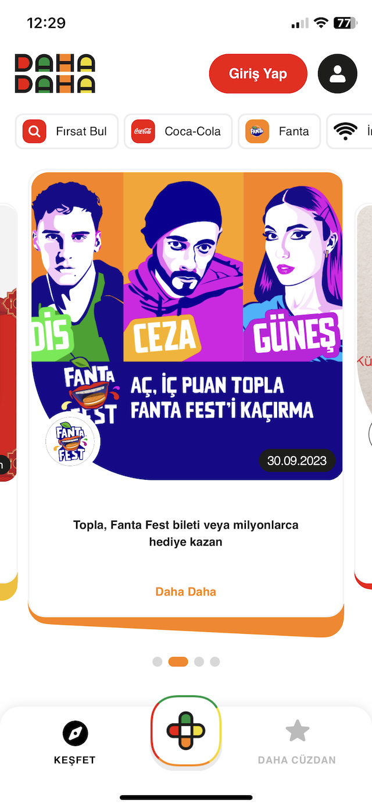
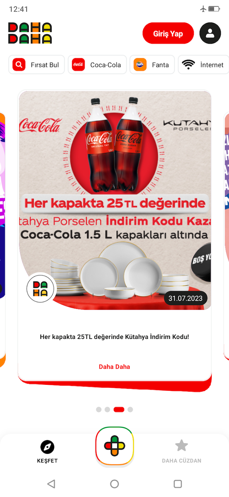

# DahaDaha Mobile App

|        iOS         |        Android        |
| :----------------: | :-------------------: |
|  |  |


## Prerequisites

- [Node.js > 16](https://nodejs.org) and npm (Recommended: Use [nvm](https://github.com/nvm-sh/nvm))
- [Watchman](https://facebook.github.io/watchman)
- [Xcode 12](https://developer.apple.com/xcode)
- [Cocoapods](https://cocoapods.org)
- [JDK > 11](https://www.oracle.com/java/technologies/javase-jdk11-downloads.html)
- [Android Studio and Android SDK](https://developer.android.com/studio)

## Usage

### Folder structure

- `src`: This folder is the main container of all the code inside your application.
  - `assets`: Asset folder to store all images, vectors, etc.
  - `components`: Folder to store any common component that you use through your app (such as a generic button)
  - `navigation`: Folder to store the navigators.
  - `screens`: Each screen should be stored inside its folder and inside it a file for its code.
  - `redux`: Folder to put all redux middlewares and the store.
- `App.js`: Main component that starts your whole app.
- `index.js`: Entry point of your application as per React-Native standards.

### Running the app

- `yarn install` -- Install the dependencies of the project.
- `yarn ios` -- (`react-native run-ios`) Build the iOS App (requires a MacOS computer).
- `yarn android` -- (`react-native run-android`) Build the Android App.

### Linting

- `yarn lint` -- Run eslint.

### Test Deep Linking

```bash
// For iOS
npx uri-scheme open dahadaha://campaign/guess-the-flavor-promo-2023/70 --ios

// For Android
npx uri-scheme open dahadaha://campaign/guess-the-flavor-promo-2023/70 --android
```

### Known Issues
- Since there is no API for filtering and the Promotions Data is limited, the filtering process is simple.